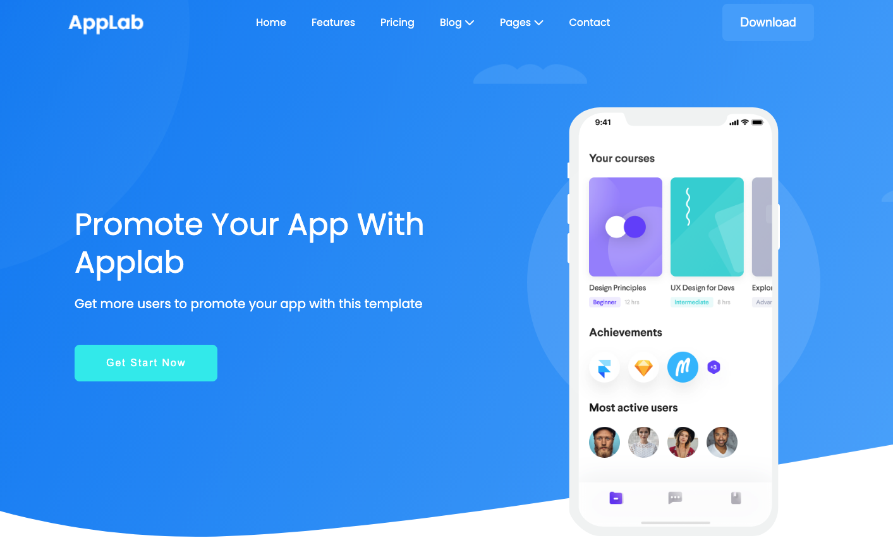
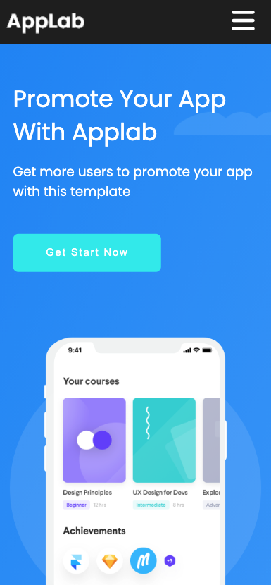
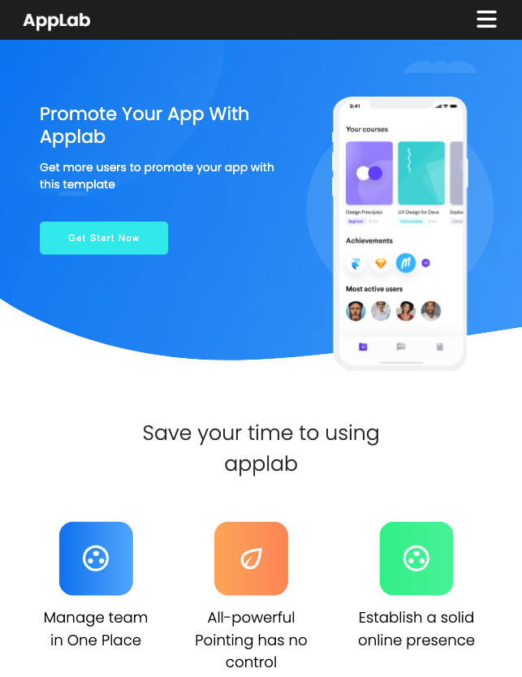

# AppLab RWD website

See the live version of [AppLab](https://jarekwach.github.io/AppLab-RWD-website/).

AppLab is a responsive landing page modeled after [Colorlib](https://colorlib.com/) free Applab template. The project was created according to the **mobile first** approach.

**Main features**:

- Semantic HTML
- CSS variables
- BEM methodology
- Mobile first approach
- RWD - designed for phone, tablet and desktop

&nbsp;

## 💡 Technologies

&nbsp;

## :camera: Screenshots

### Mobile

### Tablet

&nbsp;

## 🙋‍♂️ Feel free to contact me

Find me on...

&nbsp;

## 👏 Special thanks / Credits

- Thanks to my [Mentor - devmentor.pl](https://devmentor.pl/) – for providing me with this task and for code review.
- Thanks to [Colorlib](https://colorlib.com/) for free template.
